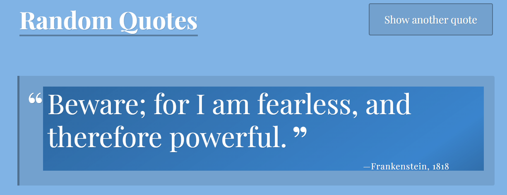

# Treehouse FSJS TechDegree - Random Quote Generator

This is my first project for the [Full Stack JavaScript Techdegree at Treehouse](https://teamtreehouse.com/techdegree/full-stack-javascript).

### Description
Random quotes are displayed with information on the _source_ and _year_, along with a button for control.
## Table of contents

- [Overview](#overview)
  - [About this project](#about-this-project)
  - [Screenshot](#screenshot)
  - [Link](#live-link)
- [Process](#the-process-for-this-project)
  - [Technologies used](#technologies-used)
  - [What I learned](#what-i-learned)
- [Author](#author)

## Overview

### About this project
This project aims to reinforce Javascript learning by implementing functions to manipulate data. The data being manipulated is an **array of objects containing key-value pairs** of all the information related to quotes from books, including the _person/character who said the quote_, the _year it was said or published_, and the actual _quote_. Some quotes have _additional information such as the year and author_.

The project features an interactive element, using a **timer method to automate the display of each quote**. A **clickable button** is provided, allowing the user to skip to the next quote and actively participate in the experience.

### Screenshot of a few Quotes

  

### Live Link

- Live Site URL: [Project 1 Random Quotes](https://samatkinsonmodeste.github.io/Random-Quotes-FSJS-P1/)

## The Process for this Project
- A variable called **Quotes** value is an array containing objects with various key value pairs.
- A function called **getRandomQuote** used **Math.floor** and **Math.random** to return a random index of the **Quotes** array.
- A function called **randomColours** used **Math.floor** and **Math.random** for three variables called **red, green and blue** to represent each colour value in CSS **RGB** colour model.
- A function called **printQuote** was used to call the **getRandomQuote**, and with a variable, each value of the objects of the **Quotes** array were inserted into a **template literal** .
- Using `document.getElementsByTagName` to target the body element and  `document.getElementById` to target the element containing the quote.  The **randomColours** function was used to calculate the values of their background colours each time a quote was displayed.
- The **setInterval** method was used to display each random quote ten seconds apart.

### Technologies Used

- Semantic HTML5 markup
- CSS 
- JavaScript

### What I Learned

I struggled to understand how to use the variable, which contained **Math.floor** and **Math.random**, in my **getRandomQuote** function together with bracket notation to grab a random index of the **Quotes** array. 
So, I now have a deeper understanding that what goes in between the brackets to get the index of an element doesn't always have to be a _number_ or a variable such as _i_.

## Author

- Team Treehouse - [samanthaatkinson](https://www.teamtreehouse.com/samanthaatkinson)
- Twitter - [@sammodeste1](https://www.twitter.com/@sammodeste1)
- LinkedIn - [sam-atkinson-modeste](https://www.linkedin.com/<<sam-atkinson-modeste>>)
- GitHub - [SamAtkinsonModeste](https://www.github.com/SamAtkinsonModeste)

